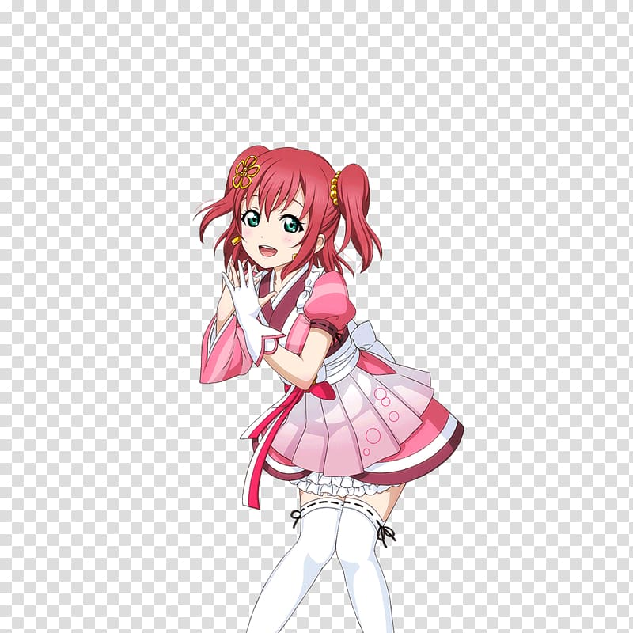

<!---

-->
# itsVxeto's GitHub Page

## My skills

>- **Linguaggi di programmazione**:
>
>
>- **Framework/Librerie**:
>
>
>- **Database**:
>
>
>- **Strumenti**:
>
>
>- **Soon**:
>
>

*yeah pretty long list, but I'll make it.*

## Projects

*Watch them on repo*

  

  

&nbsp;

